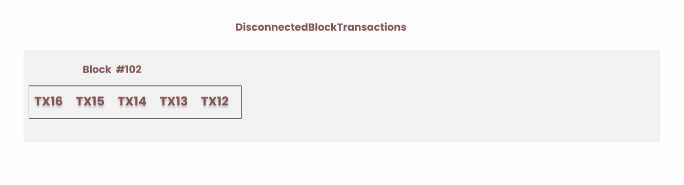
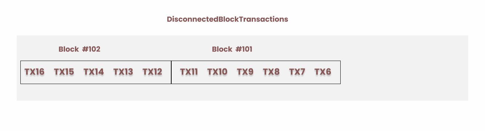
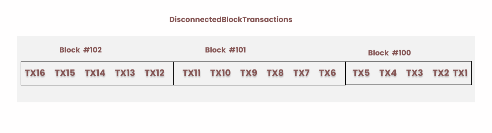

### [Bitcoin Core Disconnected Block Transactions](https://github.com/bitcoin/bitcoin/blob/2d07384243c9552aa8e95c80d7a279e2d224a753/src/kernel/disconnected_transactions.h#L37)

Bitcoin core master head commit hash before PR is `719cb301e69fa15ceed61d6f0fbaebc5eb5c04a9`

Bitcoin core PR #28385 changed the data structure of `DisconnectedBlockTransactions` from boost multi index to a C++ standard library (`stdlib`) container.

`DisconnectedBlockTransactions` is a data structure that stores the transactions removed from the chain during reorg. After the reorg is complete the transactions in `DisconnectedBlockTransactions` are added back to the mempool ready to be mined as part of `MaybeUpdateMempoolForReorg` method.

Although we expect must of the transactions in `DisconnectedBlockTransactions` to still be confirmed in the new chain. Those that are aren't are they added back to node's mempool.

Boost multi index container is a library that allows the creation of a container of objects with multiple indices and different sorting or access criteria.
See (https://www.boost.org/doc/libs/1_83_0/libs/multi_index/doc/index.html)

A very simple example of boost multi index is maintaining a container of people with name and age as keys which have their corresponding values.
    This container can have for example two indices: 
        1. List of people ordered by their name alphabetically
        2. List of people ordered by their age in descending order.

Another approach is to use `stdlib` to manage multiple containers with the different indices both with their sorting criterion, manually manage adding and removal and make sure they are in sync. However, this `stdlib` approach makes this error-prone and possibly less efficient than using Boost Multi index.

Before this PR, `DisconnectedBlockTransactions` was using a boost multi index container to manage the list of `CTransactionRef` with two indices: 
1. By transaction ID, this index is based on the hash of the transaction ID, as such you can access a transaction from the container by providing it's ID.
`txid_index` ensures that transactions are uniquely stored based on their transaction IDs
2. By the order they were added (oldest to newest). This mirrored the order of transactions in the blockchain, with newer transactions at the end and older ones towards the front. This reflects how the transactions were confirmed from new confirmations to old confirmation.

This is important when re-adding reorged transactions. Let’s take an example: suppose the blockchain's chain tip height is 102, and our node detects a competing chain with a height of 103 that has more work. These chains diverge from block 100. According to the consensus rules, Bitcoin Core node will reorg the top three blocks (100, 101, 102) in favor of the new chain and add the transactions transaction in the removed blocks that arent in the new chain to the mempool. How will it do this systematically without creating orphan transactions—transactions with missing inputs?

* Assume these are the transactions in the previous chain (Block #100).

    

* These are the transactions in the previous chain (Block #101).

    

* The previous chain tip (Block #102) has these transactions

    

If these transactions are not added to the mempool in an order, we may likely encounter a problem. We can add transactions without their parents because our mempool is full, resulting in orphan transactions with missing inputs. This becomes an issue because only 1p1c opportunistic package relay is supported in the network. There will be no way to request the ancestors of the transactions from peers, worst is even there is your peers might also be running same software and will also miss those transactions and hence we won’t be able to build a new block template with those orphan transactions.

This is why `DisconnectedBlockTransactions` maintains the order in which transactions are mined to mitigate this issue. During the reorg, block 102 will be disconnected first. 

* We will add the block 102 transactions to `DisconnectedBlockTransactions` in the order in which they were confirmed the last transaction to confirm should come first, from `Tx16` to `Tx15` ... `Tx12`.

* Then block 101 will also be disconnected, and its transactions added to `DisconnectedBlockTransactions` in the same manner.

* Likewise, block 100 will follow the same process, so the resulting disconnected block transaction indices in insertion order will be:

Such that when we are adding them back into the mempool, we will not violate the topological order of the transactions and will not have orphan transactions in the mempool.

We will start by adding `TX1`, `TX2`, etc.

`DynamicMemoryUsage` is a method that returns the total memory of `DisconnectedBlockTransactions`.

This PR updates `DisconnectedBlockTransactions` transactions to now use `stdlib`'s `std::unordered_map` and `std::list`.  
It has `std::list` of `CTransactionRef` and `std::unordered_map` to link transaction IDs (txids) to their respective iterators within the list.

Questions:

1. Why is it better to use `stdlib` than boost?
2. Why do we want to reduce dependency on boost, since bitcoin core has some heavy dependency on boost anyway?
3. In 925bb723ca71aa76380b769d8926c7c2ad9bbb7b `AddTransactionsFromBlock` comment there's a warning “We assume that callers never pass multiple transactions with the same txid, otherwise things can go very wrong in `removeForBlock` due to `queuedTx` containing an item without a corresponding entry in `iters_by_txid` are there any scenario where that might happen?
4. Did you run the benchmark before and after the PR? What are your observations?
5. What does `MallocUsage` compute?
6. Why is there a need to keep track of `cachedInnerUsage` which stores the Cached dynamic memory usage for the CTransactions, since `iters_by_txid` and `queuedTx` is what we are storing in `DisconnectedBlockTransactions`?
Hint in `DynamicMemoryUsage` method we are returning `cachedInnerUsage + memusage::DynamicUsage(iters_by_txid) + memusage::DynamicUsage(queuedTx)`;
	
7. What do you understand by the destructor comment “It's almost certainly a logic bug if we don't clear out `queuedTx` before destruction, as we add to it while disconnecting blocks, and then we need to re-process remaining transactions to ensure mempool consistency” where does this bug happen?
8. Is there any reason why `std::list` is used to store the `CTransactionRef`s ? Will `std::vector` also work?
9. In `4313c77400eb8eaa8586db39a7e29a861772ea80` Why are transactions returned after `AddTransactionsFromBlock` returned as `[[nodiscard]`.
